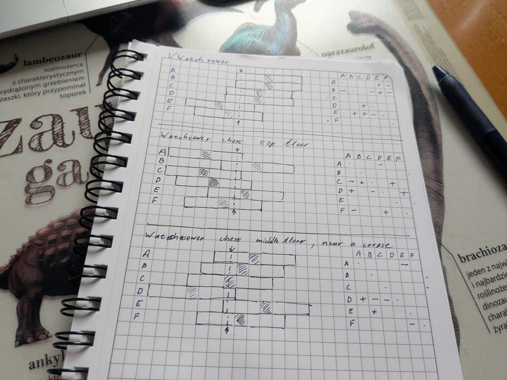

# Gothic Remake lockpicking emulator and auto-solver

While playing the new [Gothic Remake](https://gothic.thqnordic.com/) game and
encountering the lockpicking mini-game puzzle, I understood that I'm not
smart/patient enough to solve most of them. At the same time, I thought "huh,
this actually should be algorithmically solvable". And I decided to build this
web-app to do it.

It provides you an interface to map out and display dependencies between the
tumblers in the lock, as well as auto-solve it with some BFS graph-traversal.

In the later case, you just need to follow the steps/move it gives you verbatim.

Currently steps are display in the browser debug logs, I'll add some better UI
later. It will still look like ass, but maybe will be more usable.

## Quick Start

1. Open [the app](https://religiosa1.github.io/gothic-lockpick-emulator/);
2. Start lockpicking in the game;
3. Set the amount of tumblers in the corresponding input in the app;
4. Move tumblers left and right in the app, until their offset matches to the
   one in the game; [more](#how-to-replicate-a-lock-from-the-game)
5. In the game, move each tumbler, to see which tumbler moves along with it,
   and mark them in "Dependencies" table in the app. [more](#mapping-out-tumbler-dependencies)
6. Click `Save Lock` in the app;
7. Click `auto-solve` and press "F12" and then "console", to see the list of
   steps you need to perform to solve the lock.

## How the lockpicking works in the game

Any lock in the game has multiple tumblers, with 7 pins each. Each tumbler is
positioned with some offset from the center line. Your goal is to put the
central 4-th pin (between 3 pins to the left and 3 pins to the right) in the
middle.

The complexity comes from the interconnected dependencies between the
tumblers moving a tumbler, can move some other pins either in the same or
the opposite direction.

Each lock has a predetermined outline of pin offsets and their dependencies,
these definitely survive save and load games, so you can come back to them
later, close and then resume the process, etc.

I'm not sure if locks are consistent between different game attempts, different
players, etc.

## How to replicate a lock from the game

The first step is to create a representation of a lock.

This app assigns an uppercase latin character to a tumbler, the farthest away
from a lockpick (or in the top-right corner of your screen in game) is `A`, the
next one is `B`, the closest one to you is usually `E` of `F` depending on the
lock complexity.

You can create the schematic either in the app directly, I usually prefer ye
olde pen-and-paper first, before moving it to the app, if I'm stuck.

<details>

<summary>Pen and paper example:</summary>



</details>


Either way while drawing the outline, you should start with tumbler positions.
Just count the amount of pins left or right from the center line and replicate
it the offset in the app, so it matches to what you see in the game.

| This in game:                       | Mathes this in the app:             |
| ----------------------------------- | ----------------------------------- |
|  |  |

### Mapping out tumbler dependencies

After that, you need to map out dependencies between tumblers. For that, you
need to move each pin in the lock in the game, and see what other tumblers, if
any moves with it.

In the dependency table, each currently selected tumbler is displayed as a row,
and tumbler it affects while moving are represented in the columns. Click on
the column cell, blue `+` denotes a tumbler that moves into the same direction,
"a positive", red `-` denotes a tumbler that moves in the opposite direction,
"a negative".


### Saving the progress

At any point you can click "save lock", to save your progress -- this saves
your lock to your browser local storage, and the lock will survive a page
reload.

For a more permanent solution, you can export a lock you created as a file
to your computer and import it later at any time. Don't forget to name your
lock accordingly, by clicking on the header and writing the name there.

You can grab a lock file from the [locks](./locks/) folder of this repo and 
import them, to see how a finished lock looks like.

## Developing

Written in [svelte](https://svelte.dev/), requires [node.js](https://nodejs.org/en)
for development.

Once you've created a project and installed dependencies with `npm install` (or `pnpm install` or `yarn`), start a development server:

```sh
npm run dev

# or start the server and open the app in a new browser tab
npm run dev -- --open
```

## License

gothic-lockpick-emulator is MIT licensed.
